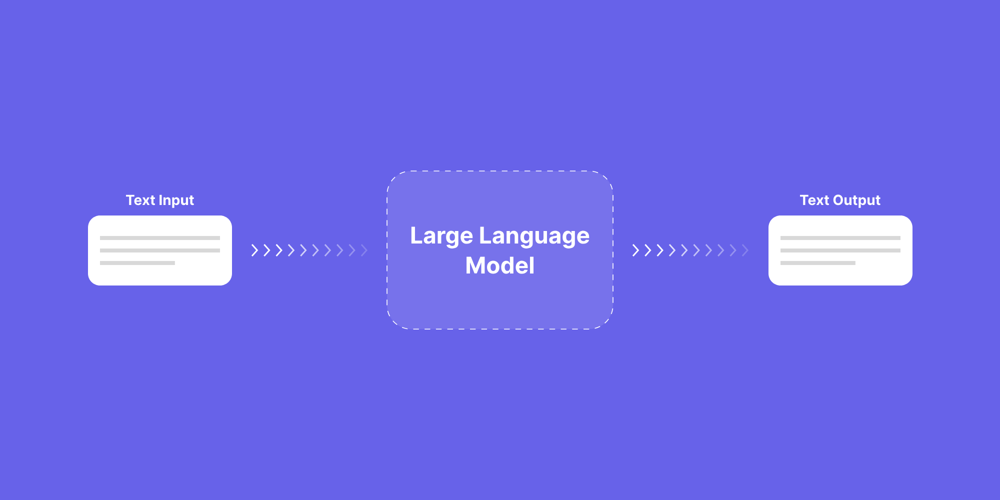
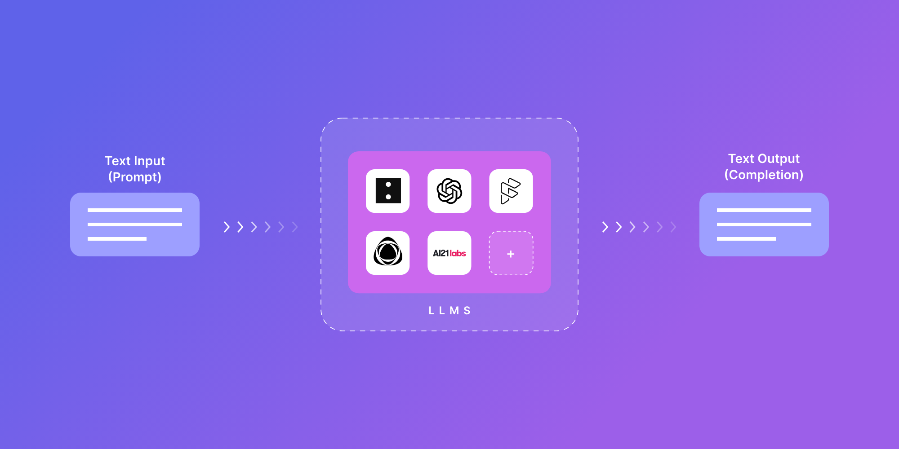
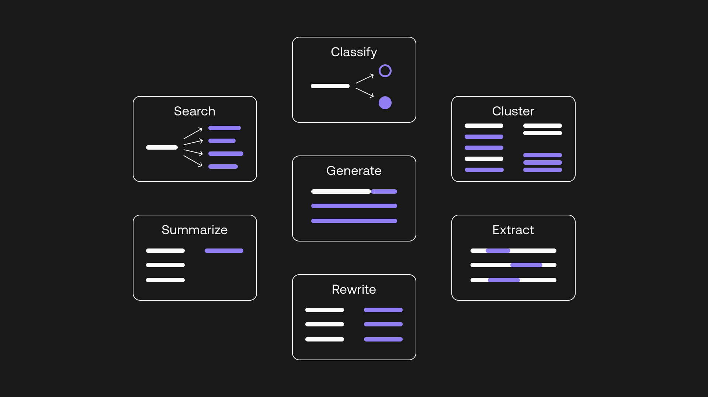

# What are LLMs?

From an application developer point of view we can think of LLMs as a black box where we send in text and get back text:

Images from https://exemplary.ai/blog/llm-history-usecases

What can it be used for?

Image from https://txt.cohere.com/llm-use-cases/

You could call an LLM via an API, e.g. HTTP API.
You could run the LLM locally, but hardware demand could be high.
There are open source and closed source LLMs.

## LLMS and companies

The best performing current open source models:
- LLMs based on the llama family:
    - Llama 2, code llama, vicuna, alpaca, orca 
- Mistral, Zaphyr
- Falcon

Companies with closed source models, usable via APIs:
- OpenAI GPT models
- Anthropic
- Google
- Cohere
- AI21
- Aleph Alpha

And there are many more players in the field.
New models are appearing probably every week.

## Places to try out LLMs

All major closed source providers have a playground on their website.
For open source models Hugging Face offers playgrounds.

For chat some websites:
- https://chat.openai.com
- https://huggingface.co/chat
- https://chat.lmsys.org

# AI4T Quality Copilot

- Introduction to the application
    - copilot helping getting from requirements to test scripts
    - imporove and generate requirements, test cases, test steps, test scripts
- prompt management
- manual prompt evaluation
    - zero shot, few shot learning
- difficulties with prompt-tuning
    - figuring out user intent in the chat
        - integration actions for editing data
    - generating gherkin
- automatic prompt testing

# Prompt evaluation

LLMs are controlled by prompts, the input text.
How to evaluate whether the respones from the LLM are good?

Different types/leves of evaluation:
- ad hoc tests
    - we start "playing" with the application and see if it works fine
- collecting evaluation/test data sets, using this for manual tests
- automatic regression tests
    - based on evalation data set
    - simple rules, like regex, contains string, is simlar to, etc.
    - feedback from LLMs, e.g. evaluate result via gpt 4, provide examples
- internal human review, testing process
    - based on the evaluation data set
- monitoring
    - error logs
    - cost and latency
- customer feedback
    - thumbs up/down
    - description of the issues

# Coding session

As a coding excersise on automated prompt testing we are going to develop a ChatBot for chatting with Frodo Baggins.
Follow README.md